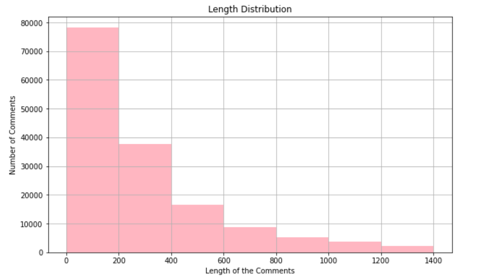

# Kaggle Jigsaw Rate Severity of Toxic Comments

## Introduction and Problem Statement
Identifying harassment in social media discussions is vital, as is determining the number of unpleasant sentiments conveyed inside the comment. Organizations can save time and manual labor in regulating these platforms by automating this comment classification approach.The primary purpose is to determine the level of negativity and toxicity in internet comments. This could help to identify people who abuse individuals. As a result, it will eventually assist in the execution of policies and the penalty of individuals who do not obey, which can subsequently be used to reduce the level of toxicity in discussions. Using LSTM, CNN and FastText we aspire to build a multi-label classification model that separates comments into six groups according to their toxicity level: toxic, severe toxic, obscene, threat, insult, and identity-hate.
 
 ## Exploratory Data Analysis
  - The data that we have used for the model is Kaggle’s Toxic Comment Classification Dataset on Wikipedia’s Talk page edits.
  - The dataset had total of `159571` samples of comments and labeled data.

  **Visualisation of Length Distribution**
  
  
  
  
  
 - Maximum comment length are ranging from `0 to 200`. 
 - Number of **toxic** comments in the dataset are significantly **higher**. **Identity Hate** comments, on the other hand, are the **lowest**.
 
 
  ## Methodology
  
  1. Data Analysis
  2. Data preprocessing
     - Text Normalisation
     - Lemmatization
     - Stop-words Removal
     - Tokenization
  3. Embedding words into vectors using `FastText`
  4. Trained Model using LSTM, LSTM-CNN
  5. Model Evaluation 
     - Achieved the best accuracy using `LSTM`
     - Acurracy : Train Data - **99.08%** Test Data - **99.32%**
  
  **Visualization of Accuracy**
  
  
  
  **Visualization of Loss**
  
  

## Challenges
- Unstructured comments may contain unwanted words or characters
- Selecting an efficient model 
- Hyper-parameter tuning to avoid bias and variance problem, and achieving the best possible accuracy
- There will be more hurdles to overcome, but Google, StackOverflow, and GitHub will always be your best friends.
  
